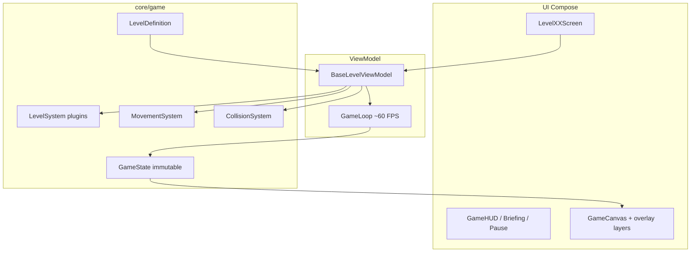

# Логика Cyber Maze и шаблон уровня

Подробное описание того, как работает игровой движок в коде, как устроен рендер (включая **интерполяцию**), и как собрать уровень «со всеми механиками» на базе пакета `features/level_template/`.

Краткий чеклист для авторов уровней — в [LEVEL_DEVELOPER_GUIDE.md](LEVEL_DEVELOPER_GUIDE.md). Дизайн из ТЗ — в [CyberMaze_TZ.md](../CyberMaze_TZ.md).

---

## 1. Архитектура (слои)



| Слой | Пакет / класс | Роль |
|------|----------------|------|
| Экран | `features/level_XX/LevelXXScreen.kt` | Compose: фон, canvas, оверлеи, HUD, фазы BRIEFING/PLAYING/… |
| ViewModel | `features/game/BaseLevelViewModel.kt` | Цикл симуляции, ввод, пауза, рестарт, победа/поражение |
| Определение уровня | `core/game/engine/LevelDefinition.kt` | Карта, враги, ловушки, телепорты, системы, палитра, туман |
| Плагины | `core/game/system/*` | Доп. механики (туман, стражи, ловушки, …) |
| Модель | `core/game/model/*` | `Player`, `Enemy`, `GameMap`, `GameState` — **immutable** |
| Рендер | `core/ui/renderer/*` | Отрисовка по снимку `GameState` |

Каждый кадр симуляции возвращает **новый** `GameState` (`copy`), а не мутирует старый.

---

## 2. Жизненный цикл уровня

### 2.1. Фазы (`GamePhase`)

| Фаза | Когда | Что делает UI |
|------|--------|----------------|
| `BRIEFING` | Старт уровня | `LevelBriefingScreen`, кнопка START → `onStart()` |
| `PLAYING` | Идёт игра | Canvas, HUD, D-Pad / свайпы |
| `PAUSED` | Пауза | `PauseMenu`, `GameLoop.pause()` |
| `WIN` | Победа | `LevelCompleteScreen`, сохранение прогресса |
| `LOSE` | Поражение | `GameOverScreen` |

`GameLoop` в фазах `BRIEFING` / `PAUSED` / `WIN` / `LOSE` **не** вызывает `onTick` (проверка `phase == PLAYING`).

### 2.2. Инициализация (`setupLevel`)

1. Подкласс `LevelXXViewModel` в `init`:
   - `LevelLoader.validateLayout(MAP)` — все строки **одинаковой** ширины, есть `X` и `E`.
   - `LevelLoader.loadFromStringArray(MAP, config)` → `GameMap`.
   - `CollectibleSystem.createCollectiblesFromMap(map)`.
2. `setupLevel(LevelDefinition(...))` в `BaseLevelViewModel`:
   - Игрок на `map.playerSpawn`, фаза `BRIEFING`.
   - `extraSystems` сохраняются для тиков.
   - `gameLoop.launchIn(viewModelScope)`.

### 2.3. Игровой цикл (`GameLoop`)

- Целевой интервал: **~16 ms** (`FRAME_DELAY_MS`), ~60 FPS.
- `deltaTime` = секунды с прошлого кадра, **не больше 0.1 с** (`MAX_DELTA`) — защита от скачка после долгой паузы.
- При `pause()` накопленное время сбрасывается при `resume()`.

---

## 3. Один тик симуляции (`BaseLevelViewModel.onTick`)

Порядок **фиксирован**; от него зависит баланс.

```mermaid
sequenceDiagram
    participant Tick as onTick
    participant Player as Player timers
    participant Move as MovementSystem
    participant Land as handlePlayerLanding
    participant Enemy as EnemySystem
    participant Coll as Tile collision
    participant Ext as extraSystems
    participant End as checkEndConditions

    Tick->>Player: advanceTimers(delta)
    Tick->>Move: auto-step if direction set and canStep
    Move->>Land: on new tile
    Tick->>Enemy: updateEnemies
    Tick->>Coll: same tile as enemy?
    Tick->>Ext: fold update (traps, guards, fog, teleports cooldown)
    Tick->>End: WIN / LOSE
```

### 3.1. Таймеры игрока

`Player.advanceTimers(delta)`:

- `moveTimer += delta` — накопление до следующего шага по сетке.
- `invincibilityTimer` — убывает (после удара).
- `speedBoostSecondsLeft` — убывает; при 0 → `resetSpeed()`.
- `shieldSecondsLeft` — убывает (щит с тайла `H`, по умолчанию **20 с**).

### 3.2. Автошаг игрока (логика «как Pac-Man»)

Условие шага: `direction != NONE` и `moveTimer >= effectiveStepInterval()`.

```
effectiveStepInterval = moveInterval / speedMultiplier
```

По умолчанию `moveInterval = 0.18` с, `speedMultiplier` после спавна **0.5** (медленнее базового), с `S` — **1.5** на **3 с**.

При успешном шаге:

- `movedTo(newTile)` → `previousPosition = old`, `position = new`, `resetMoveTimer()`.
- `handlePlayerLanding` (см. ниже).

При блокировке стеной:

- `previousPosition` принудительно = `position` (нет «долгого» слайда в стену).
- `moveTimer` выставляется в `effectiveStepInterval()` — при освобождении пути следующий шаг сразу доступен.

### 3.3. Ввод игрока (`onDirectionInput`)

Отдельно от тика: при свайпе / D-Pad **только** выставляется `direction` (намерение). Шаг выполняется **исключительно** в `onTick`, когда `canStep()` — свайп не может обойти `moveTimer` и давать неограниченную скорость.

Если путь заблокирован, направление всё равно запоминается; как только клетка свободна, следующий тик сделает шаг.

**Дверь:** игрок **может** зайти на тайл `D` с ключом (`canPlayerMove`); открытие — в `handlePlayerLanding` через `CollisionSystem.openDoor` (тайл `D` → `EMPTY`, ключ −1).

### 3.4. `handlePlayerLanding` (после каждого нового тайла игрока)

1. Все collectibles на клетке игрока → `CollectibleSystem.collectItem`.
2. `ENERGY_POINT` → `GameState.collectPoint()` (+1 к `collectedPoints`).
3. Для каждого подбора: `extraSystems.onCollectibleCollected` (порядок систем важен).
4. Стоит на `DOOR` и есть ключ → открыть дверь, событие `DoorOpened`.
5. `extraSystems.onPlayerLanded` (телепорты срабатывают здесь).

### 3.5. Враги (`EnemySystem`)

Для каждого активного врага:

- `moveTimer += delta`.
- Если `canMove()` (интервал `1 / (speed * speedMultiplier)`):
  - AI по типу (`MovementSystem.moveEnemy`):
    - **PATROL** — следующая точка `patrolPath`.
    - **CHASER** — шаг по оси к игроку (primary/secondary), иначе random.
    - **RANDOM / FAST** — случайный ход (FAST быстрее по `speed`).
    - **GUARD** — не двигается.
  - `resetTimer()` после шага.

Затем **тайловая** коллизия: `enemy.position == player.position` → `applyEnemyHit` (если не `isInvincible`).

### 3.6. Плагины (`extraSystems.update`)

Вызываются **после** движения врагов и тайловой коллизии. Типичный порядок в шаблоне:

1. `PowerUpSystem` — таймер замедления врагов.
2. `SpeedBoostSystem` — заглушка (тайминг в `Player`).
3. `TeleportSystem` — только `tickCooldowns` в `update`.
4. `MovingTrapSystem` — шаг ловушек + урон на клетке.
5. `GuardSystem` — поворот стража + урон в конусе.
6. `FogOfWarSystem` — таймер расширения видимости от `P`.

### 3.7. Победа и поражение

**Победа** (`GameState.hasWon`):

- `collectedPoints >= config.requiredPoints`
- `player.position == map.exitPosition`

**Поражение** (`hasLost`):

- `lives <= 0`, или
- уровень с таймером и `elapsedTime >= timeLimit`.

**Звёзды** (`LevelResult.calculateStars`):

| Звезда | Условие |
|--------|---------|
| 1 | Победа |
| 2 | Победа и `time <= timeLimit * 0.75` (нужен `timeLimit`) |
| 3 | Все `o` собраны и `livesLost == 0` |

---

## 4. Урон и защита

### 4.1. Источники урона

| Источник | Условие | Обработчик |
|----------|---------|------------|
| Враг | Одна клетка с игроком | `CollisionSystem` + `applyEnemyHit` |
| Ловушка | `trap.position == player.position` | `MovingTrapSystem` → `HazardDamage` |
| Страж | Игрок в конусе на 1…`damageRange` клеток по лучу | `GuardSystem` → `HazardDamage` |

**Важно:** страж бьёт **не обязательно** с соседней клетки — по умолчанию `damageRange = 3` (на уровне 10 часто `damageRange = 1`).

### 4.2. `HazardDamage.applyPlayerHit`

Если `player.isInvincible` → без изменений.

Иначе `CollisionSystem.handleEnemyCollision`:

1. Есть щит (`shieldSecondsLeft > 0`) → снять щит + короткая неуязвимость.
2. Иначе → `loseLife()` + неуязвимость **1.5 с** (`DEFAULT_INVINCIBILITY`).

Если жизнь потеряна, но игрок жив:

- Телепорт на `map.playerSpawn`, `direction = NONE`, сброс `moveTimer`.
- `livesLost++` в `GameState`.

События: `PlayerHit`, `PlayerRespawned` / `PlayerDied`, `HazardHit`.

### 4.3. Неуязвимость

`isInvincible = invincibilityTimer > 0 || hasShield`

Пока активно — повторные удары (враг, ловушка, страж) игнорируются.

---

## 5. Интерполяция движения (рендер)

### 5.1. Разделение логики и картинки

- **Логика** работает в **дискретной сетке**: позиция всегда целые `(x, y)`.
- **Рендер** сглаживает переход между клетками по `previousPosition`, `position`, `moveTimer`.

Так игрок и враги «едут» плавно, хотя симуляция шагает по тайлам.

### 5.2. Поля для интерполяции

| Сущность | Поля |
|----------|------|
| Игрок | `previousPosition`, `position`, `moveTimer`, `effectiveStepInterval()` |
| Враг (не GUARD) | то же |
| GUARD | только `position` (без слайда) |
| Телепорт / респавн | `snappedTo` — `previousPosition = position` (без анимации перелёта) |

При `movedTo`: `previousPosition` = клетка **до** шага, `position` = клетка **после**, `moveTimer` обнуляется.

### 5.3. Формула (`GameCanvas.interpolatedTopLeft`)

```text
progress = clamp(moveTimer / effectiveStepInterval, 0, 1)

worldX = (prev.x + (curr.x - prev.x) * progress) * tileSize + offsetX
worldY = (prev.y + (curr.y - prev.y) * progress) * tileSize + offsetY
```

- `progress = 0` — спрайт у `previousPosition`.
- `progress = 1` — у `position`.
- При блокировке движения `progress` часто остаётся 1 (prev = curr).

### 5.4. Координаты карты на экране (`MapCanvasMetrics`)

```text
tileSize = min(screenWidth / mapWidth, screenHeight / mapHeight)
offsetX = (screenWidth  - mapWidth  * tileSize) / 2
offsetY = (screenHeight - mapHeight * tileSize) / 2
```

`GameCanvas` и оверлеи (`GuardVisionLayer`, `MovingTrapsLayer`, `FogOfWarLayer`) используют **одинаковую** метрику (`Size.toMapMetrics`), чтобы конусы и ловушки совпадали с тайлами.

### 5.5. Оверлеи без интерполяции ловушек

`MovingTrapsLayer` рисует ловушку в **текущей** `trap.position` (дискретно). Предупреждение «скоро шаг» — пульс, если `moveTimer` близок к `moveInterval`.

---

## 6. Механики и `LevelSystem`

### 6.1. Сводная таблица

| Символ / сущность | Collectible / данные | LevelSystem | Слой UI |
|-------------------|----------------------|-------------|---------|
| `o` | `ENERGY_POINT` | — (база) | `GameCanvas` |
| `K` | `KEY` | — | Canvas |
| `D` | — (тайл карты) | — | Canvas + `openDoor` |
| `P` | `POWER_UP` | `PowerUpSystem` | HUD: `powerUpSecondsLeft` |
| `S` | `SPEED_BOOST` | `SpeedBoostSystem` (*) | HUD: `speedBoostSecondsLeft` |
| `H` | `SHIELD` | — (таймер в `Player`) | HUD: `hasShield` |
| `A`/`B` | — | `TeleportSystem` | `TeleportPulseLayer` |
| Ловушки в коде | `MovingTrap` + `path` | `MovingTrapSystem` | `MovingTrapsLayer` |
| GUARD | `Enemy` + `lookDirection` | `GuardSystem` | `GuardVisionLayer` |
| Туман | `baseFogRadiusTiles` | `FogOfWarSystem` | `FogOfWarLayer` |

(*) `SpeedBoostSystem.update` — no-op; ускорение считает `Player.advanceTimers`.

### 6.2. Power-up (`P`)

- При подборе: `powerUpSecondsLeft = 5`, всем врагам `speedMultiplier = 0.3`.
- Если включён туман: `fogVisionBoostSecondsLeft = 5` → радиус `base + 2` (`effectiveFogRadiusTiles`).
- **Порядок:** в шаблоне `PowerUpSystem` **до** `FogOfWarSystem`, чтобы оба обработали `POWER_UP`.

### 6.3. Speed boost (`S`)

- `speedMultiplier = 1.5`, длительность **3 с** (`CollectibleSystem.SPEED_BOOST_MULT`).

### 6.4. Shield (`H`)

- `shieldSecondsLeft = 20` с (`Player.DEFAULT_SHIELD_DURATION`).
- Поглощает один удар, затем неуязвимость как после обычного хита.

### 6.5. Teleport (`A` / `B`)

- Список `TeleportPair` в `LevelDefinition` — координаты **должны совпадать** с тайлами на карте.
- При `onPlayerLanded` на `posA`/`posB` (если кулдаун 0): `snappedTo` на пару, событие `PlayerTeleported`.
- Кулдаун на противоположной точке (`cooldownDuration`, по умолчанию 1.5 с).

### 6.6. Moving trap

- Не берётся с тайла `T` на карте (в шаблоне `T` только декоративный маркер).
- Задаётся в `LevelXXTraps.kt`: `path` — список клеток, циклический обход.
- Каждые `moveInterval` секунд — `stepForward()`.
- Урон = как враг на одной клетке.

### 6.7. Guard

- Стоит на месте, каждые **3 с** поворачивает `lookDirection` по часовой.
- Урон: игрок на клетке в луче `1..damageRange` (стены и закрытые `D` блокируют луч).
- `GuardVisionLayer` рисует конус (**3** клетки вперёд) для предупреждения.

### 6.8. Fog of war

- Включение: `LevelDefinition.baseFogRadiusTiles = N` (не `null`).
- Видимость: Manhattan-«ромб» вокруг игрока радиуса `N` (+2 при активном бусте от `P`).
- `FogOfWarLayer` затемняет невидимое; логика видимости — `FogOfWarSystem.visiblePositions`.

---

## 7. Карта и `LevelLoader`

### 7.1. Легенда символов

| Символ | `TileType` | Проходимость |
|--------|------------|--------------|
| `#` | `WALL` | нет |
| `.` | `EMPTY` | да |
| `o` | `ENERGY_POINT` | да (collectible) |
| `X` | `SPAWN_POINT` | да (спавн) |
| `E` | `EXIT` | да |
| `K` | `KEY` | да |
| `D` | `DOOR` | для врагов нет; игрок с ключом может зайти |
| `A` / `B` | `TELEPORT_A` / `TELEPORT_B` | да |
| `P` / `S` / `H` | power / speed / shield | да |
| `T` | `TRAP` | визуал на карте; движущиеся ловушки — отдельно в коде |

### 7.2. Правила валидности

1. Все строки **одинаковой длины** (иначе краш в `require` при загрузке ViewModel).
2. Ровно один `X` и один `E`.
3. Враги и waypoints ловушек — только на проходимых клетках.

Рекомендация: в `LevelXXMap.kt` после массива:

```kotlin
.also {
    check(LevelLoader.validateLayout(it).isEmpty()) {
        "LEVEL_XX_MAP invalid: ${LevelLoader.validateLayout(it)}"
    }
}
```

---

## 8. Шаблон уровня (`features/level_template/`)

Пакет **не** в `NavGraph` — эталон для копирования. Показывает **все** механики.

### 8.1. Файлы пакета

| Файл | Назначение |
|------|------------|
| `LevelTemplateMap.kt` | ASCII-карта со всеми символами |
| `LevelTemplateConfig.kt` | `LevelConfig` (очки, флаги, описание) |
| `LevelTemplateEnemies.kt` | PATROL, CHASER, RANDOM, FAST, GUARD |
| `LevelTemplateTraps.kt` | `MovingTrap` с путём |
| `LevelTemplateTeleports.kt` | `TeleportPair` (координаты A/B) |
| `LevelTemplatePalette.kt` | `LevelPalette` |
| `LevelTemplateViewModel.kt` | Все `LevelSystem` + `baseFogRadiusTiles = 3` |
| `LevelTemplateScreen.kt` | Полный стек слоёв UI |

### 8.2. `LevelDefinition` в шаблоне

```kotlin
LevelDefinition(
    config = LEVEL_TEMPLATE_CONFIG,
    map = map,
    enemies = LEVEL_TEMPLATE_ENEMIES.map { it.copy() },
    traps = LEVEL_TEMPLATE_TRAPS.map { it.copy() },
    teleports = LEVEL_TEMPLATE_TELEPORTS.map { it.copy() },
    baseFogRadiusTiles = 3,           // null — без тумана
    extraSystems = listOf(
        PowerUpSystem,                // до FogOfWarSystem!
        SpeedBoostSystem,
        TeleportSystem,
        MovingTrapSystem(collisionSystem),
        GuardSystem(collisionSystem), // damageRange по умолчанию 3
        FogOfWarSystem
    ),
    palette = LEVEL_TEMPLATE_PALETTE
)
```

### 8.3. Стек экрана (снизу вверх)

Как в `LevelTemplateScreen`:

1. `LevelBackgroundLayer` (Grid / Radial / ScanLines) — опционально.
2. `GameCanvas(drawBackground = false)` — тайлы, сущности, **интерполяция**.
3. `MovingTrapsLayer`
4. `TeleportPulseLayer`
5. `FogOfWarLayer` — если `fogBaseRadiusTiles != null`
6. `GuardVisionLayer`
7. `GameHUD`
8. `DPadControl` — только в `PLAYING`
9. Оверлей фазы: Briefing / Pause / Win / Lose

Если механика не нужна — удалите и **систему**, и **слой**, и данные (ловушки/телепорты/туман).

### 8.4. Рестарт (`createInitialState`)

Шаблон переопределяет сброс:

- Игрок на спавн, collectibles заново, счётчики обнулены.
- Враги / ловушки / телепорты — из исходных Kotlin-списков.
- `powerUpSecondsLeft`, `fogVisionBoostSecondsLeft`, `fogBaseRadiusTiles` — как при старте.
- `phase = PLAYING` (можно `BRIEFING` — как у вас принято на уровне).

Без переопределения базовый `createInitialState` не восстанавливает врагов из `LEVEL_XX_ENEMIES` — только сбрасывает множители на уже живом списке.

---

## 9. Минимальный уровень vs полный

| | Level 01 | level_template |
|--|----------|----------------|
| `extraSystems` | пусто | все системы |
| Оверлеи | только Canvas + HUD | все слои |
| Туман | нет | `baseFogRadiusTiles = 3` |
| Сложность | обучение | эталон механик |

Для своего уровня: скопируйте `level_template` → `level_XX`, удалите лишнее, **проверьте ширину каждой строки карты**.

---

## 10. Частые ошибки

1. **Разная длина строк карты** — мгновенный краш в `init` ViewModel.
2. **TeleportPair** не совпадает с тайлами `A`/`B` на карте.
3. **Враг на стене** — AI ломается или не двигается.
4. **Путь ловушки через `#`** — ловушка застрянет или не дойдёт.
5. **Два `LevelSystem` на один collectible** — порядок в `extraSystems` решает, кто первый обработает `P`.
6. **HUD перекрывает поле** — вынесите gameplay в `Box` с `padding(top = …)` (см. Level 07).
7. **Забыли слой** — механика работает, но не видна (например `GuardVisionLayer`).

---

## 11. Ссылки на исходники

| Тема | Файл |
|------|------|
| Тик симуляции | `features/game/BaseLevelViewModel.kt` |
| Интерполяция | `core/ui/renderer/GameCanvas.kt` → `interpolatedTopLeft` |
| Метрики canvas | `core/ui/renderer/MapCanvasMetrics.kt` |
| Движение / AI | `core/game/system/MovementSystem.kt` |
| Коллизии | `core/game/system/CollisionSystem.kt` |
| Урон | `core/game/engine/HazardDamage.kt` |
| Игрок | `core/game/model/Player.kt` |
| Враг | `core/game/model/Enemy.kt` |
| Загрузка карты | `core/game/level/LevelLoader.kt` |
| Шаблон VM | `features/level_template/LevelTemplateViewModel.kt` |
| Шаблон UI | `features/level_template/LevelTemplateScreen.kt` |
